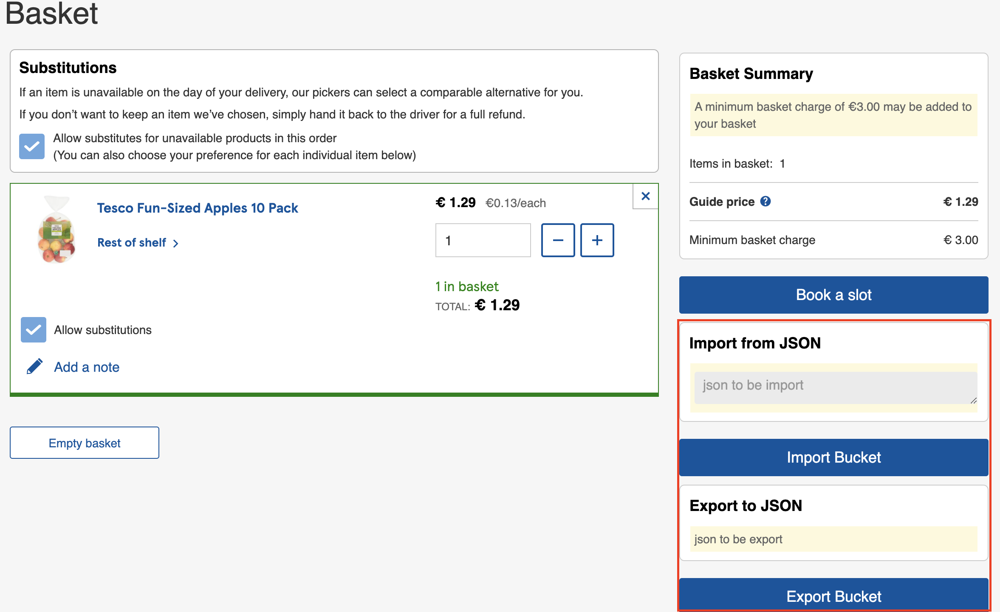

# 安裝
下載 Temper Monkey 瀏覽器插件後，到下列位置安裝。
https://github.com/aldy120/testco-ie-tools/raw/master/index.user.js

# 用途
- 輸出購物車
- 合併兩個帳戶的購物車

# 原理
將被匯入單全部新增到目前單裡面，如果被匯入單品項已經在目前單，會累加數量。目前無法支援公斤等單位。

# 觸發條件
到[購物車的頁面](https://www.tesco.ie/groceries/en-IE/trolley)，然後**重整頁面**。

目前一定要按重整頁面，否則按鈕不會跳出來。因為程式沒寫好。

# 用法
1. 從某帳戶匯出購物車
2. 到另一個帳戶匯入購物車

